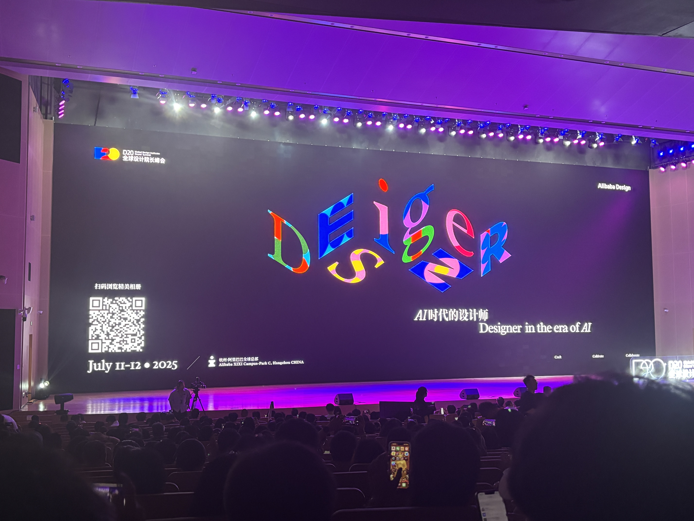

<section class="page-hero page-hero--plain course-hero course-hero--no-watermark" markdown="1">

<h1>Exhibitions & Conferences</h1>

<!-- BLOG -->

Recording and sharing personal academic experiences, life experiences, and related reflections.

</section>

<!-- Main layout -->

<!-- Left article area -->

<!-- Article 1 -->
<article class="post">

Personal
University

2024-06-27-28 · Conference

<h2 class="post__title">2024 D20 Summit</h2>

Design in the AI Era

<a href="2024D20/" class="post__link">Read More →</a>

</article>

<!-- Article 2 -->
<article class="post">

Personal
University

2025-06-30-07-04 · Travel

<h2 class="post__title">Japan · Osaka · Kyoto</h2>

Attending the D20 Summit organized by the Alibaba Design Committee.

<a href="Japan-travel/" class="post__link">Read More →</a>

</article>

<!-- Article 3 -->
<article class="post">

Personal
University

2025-07-11 · Conference

<h2 class="post__title">2025 D20 Summit</h2>

Designers in the AI Era

<a href="2025D20/" class="post__link">Read More →</a>

</article>

