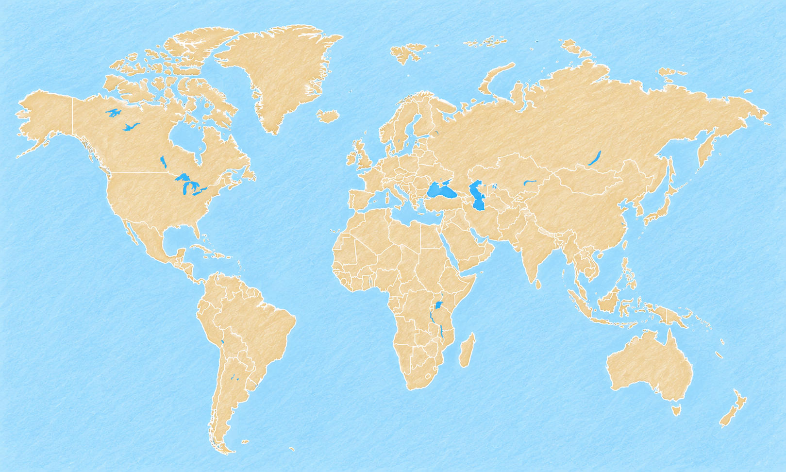
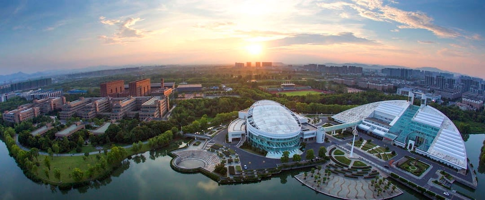
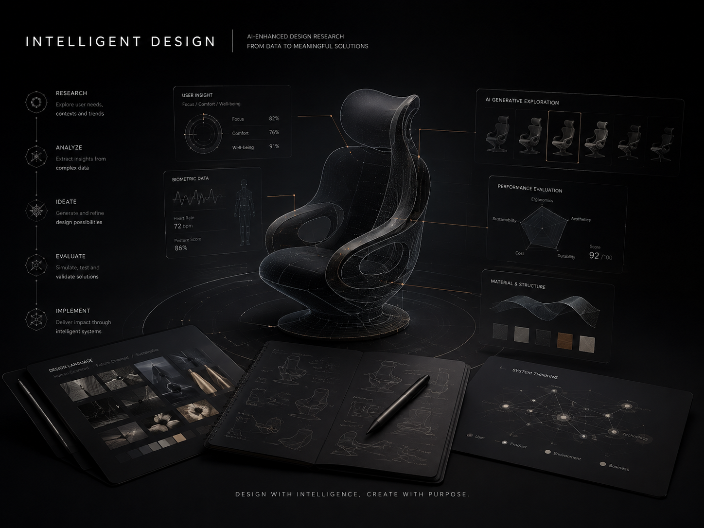
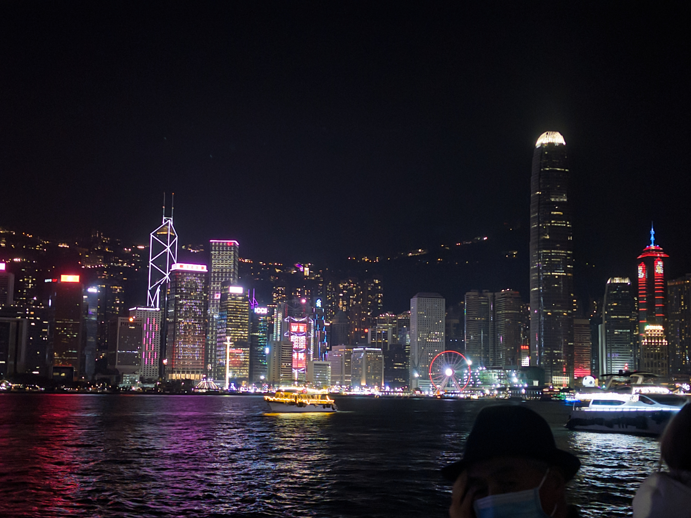
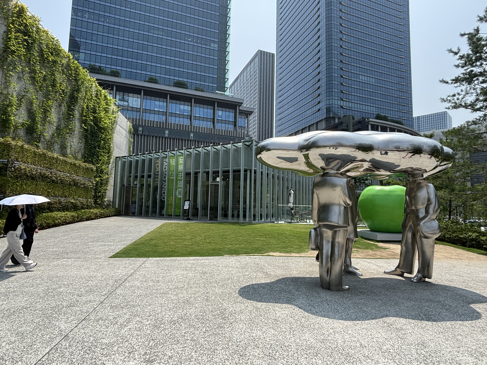

<section class="page-hero page-hero--plain course-hero course-hero--no-watermark">

<h1>Travel Blogs</h1>

<!-- TRAVEL -->

Recording travel routes, city impressions, and small notes from places I have visited.

</section>

<h2 style="font-size: clamp(1.45rem, 1vw, 2.35rem) !important;">Places I have been to</h2>

Click a city marker to switch the travel note.

<button class="travel-pin travel-pin--active" type="button" data-travel-city="shanghai" style="--pin-x: 79%; --pin-y: 48.5%;" aria-label="Shanghai" aria-pressed="true">Shanghai</button>
<button class="travel-pin" type="button" data-travel-city="singapore" style="--pin-x: 75%; --pin-y: 64%;" aria-label="Singapore" aria-pressed="false">Singapore</button>
<button class="travel-pin" type="button" data-travel-city="hong-kong" style="--pin-x: 76.5%; --pin-y: 53.2%;" aria-label="Hong Kong" aria-pressed="false">Hong Kong</button>
<button class="travel-pin" type="button" data-travel-city="osaka·kyoto" style="--pin-x: 83.7%; --pin-y: 45.3%;" aria-label="Osaka··Kyoto" aria-pressed="false">Osaka·Kyoto</button>

China

<h3>Shanghai</h3>
A city that keeps daily life, learning, and design practice close together.

Singapore

<h3>Singapore</h3>
Compact, warm, and highly organized, with public systems visible everywhere.

China

<h3>Hong Kong</h3>
Layers of streets, signs, transport, and harbor views create a strong city rhythm.

Japan

<h3>Osaka·Kyoto</h3>
A city that keeps daily life, learning, and design practice close together.

<!-- Article 1 -->
<article class="post">

Personal
University

2024-06-27-28 · Travel

<h2 class="post__title">2024 D20 Summit</h2>

Design in the AI Era

<a href="2024D20/" class="post__link">Read More →</a>

</article>

<!-- Article 2 -->
<article class="post">

Personal
University

2025-06-30-07-04 · Travel

<h2 class="post__title">Japan · Osaka · Kyoto</h2>

Attending the D20 Summit organized by the Alibaba Design Committee.

<a href="../Japan-travel/" class="post__link">Read More →</a>

</article>

<!-- Article 3 -->
<article class="post">

Personal
University

2025-07-11 · Travel

<h2 class="post__title">China · Hong Kong</h2>

Designers in the AI Era

<a href="2025D20/" class="post__link">Read More →</a>

</article>

