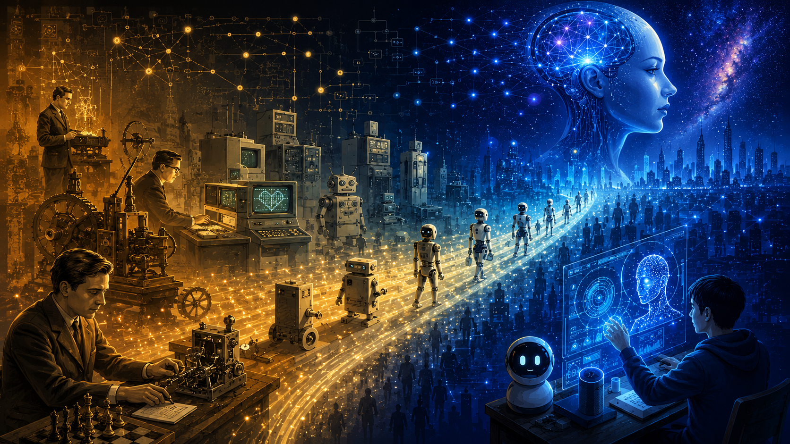

<section class="page-hero page-hero--plain course-hero course-hero--no-watermark" markdown="1">

  <h1>The History of AI</h1>
  <!-- COURSE -->

In this section, I would like to share some knowledge with you about **artificial intelligence** and **agents**, as well as recommending some related courses and books.
Tips: Some knowledge can be fun and interesting, while other knowledge can be boring or even incorrect. So just enjoy it with your coffee! ☕

</section>

<h2>1930</h2>

<section class="ai-history-feature">
  

  
Alan Turing

  <h3>The Idea of Computation</h3>

  Turing helped turn the question “Can machines think?” into something that could be studied through logic, symbols, and computation. His work prepared the ground for later conversations about artificial intelligence, not as magic, but as a system that could follow rules, process information, and produce behavior.
  

  
</section>

<h2>1930</h2>

