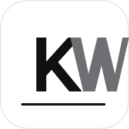

---
hide:
  - navigation
  - toc
---

<section class="home-hero">
  

    

      
    

    
Learning · Building · Designing

    <h1>Kai Wang</h1>
    
我在这里记录学习、打磨项目，也把零散的想法整理成清晰的作品。网站保持简洁，把注意力留给真正有价值的内容。

    

      <a href="project/" class="home-button home-button-primary">查看项目</a>
      <a href="course/" class="home-button">阅读笔记</a>
    

  

  

    
    

      Portfolio system
      <strong>从内容到作品，形成长期可更新的个人空间。</strong>
    

  

</section>

<section class="home-section home-manifesto">
  
网站的方向

  <h2>少一点堆砌，多一点判断。</h2>
  
我希望这个网站像一个安静但有秩序的工作台：课程笔记用来沉淀知识，项目页面用来展示实践，关于页面用来说明我是谁、我正在靠近什么。

</section>

<section class="home-feature-grid">
  <a class="home-feature interaction-tilt" href="course/" data-tilt>
    01
    <h2>课程笔记</h2>
    
把学习过程整理成可复用的知识卡片，而不是只留下零散收藏。

  </a>
  <a class="home-feature interaction-tilt" href="project/" data-tilt>
    02
    <h2>项目作品</h2>
    
像展示产品一样展示项目：主角明确，价值清楚，过程可追溯。

  </a>
  <a class="home-feature interaction-tilt" href="about/" data-tilt>
    03
    <h2>关于我</h2>
    
持续更新我的方向、能力边界和正在形成的个人风格。

  </a>
</section>
