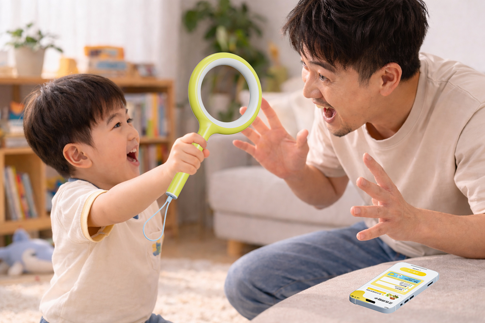
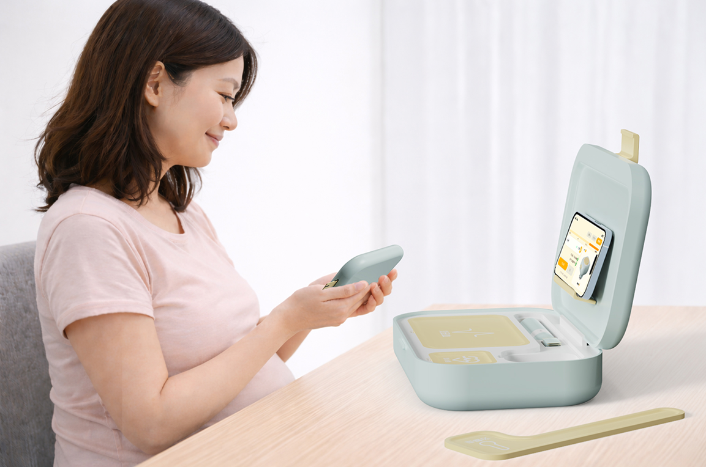

---
hide:
  - navigation
  - toc
---

<section class="home-hero">
  

    
学习 · 创作 · 设计

    <h1>代码即设计</h1>
    
一个持续搭建和迭代的个人作品集系统，用来记录学习、设计判断和项目实践。

    

      <a href="project/" class="home-button home-button-primary">查看项目</a>
      <a href="course/" class="home-button">阅读笔记</a>
    

  

  

    <a class="home-visual home-visual-card interaction-tilt" data-tilt href="project/costory/">
      
      

        项目 01
        

          COSTORY
        

        <strong>用实体道具和 AI 轻提示，帮助亲子在共创中把故事继续讲下去。</strong>
        查看项目 →
      

    </a>
    <a class="home-visual home-visual-card interaction-tilt" data-tilt href="project/website-system/">
      
      

        项目 02
        

          WAING
        

        <strong>把个人网站变成可以被持续编辑、评估和发布的作品集系统。</strong>
        查看项目 →
      

    </a>
    <a class="home-visual home-visual-card interaction-tilt" data-tilt href="project/">
      
      

        项目 03
        

          交互设计练习
        

        <strong>观察优秀界面，把设计判断转化成自己的页面实践。</strong>
        查看项目 →
      

    </a>
  

</section>

<section class="home-section home-manifesto">
  
网站的方向

  
少一点堆砌，多一点判断。

  
这个网站不仅展示结果，也记录我如何借助 AI 协作、低代码管理和设计评估，把一个个人空间持续打磨成可维护的作品集系统。

</section>

<section class="home-feature-grid">
  <a class="home-feature interaction-tilt" href="course/" data-tilt>
    01
    <h2>课程笔记</h2>
    
把学习过程整理成可复用的知识卡片，而不是只留下零散收藏。

  </a>
  <a class="home-feature interaction-tilt" href="project/" data-tilt>
    02
    <h2>项目作品</h2>
    
像展示产品一样展示项目：主角明确，价值清楚，过程可追溯。

  </a>
  <a class="home-feature interaction-tilt" href="about/" data-tilt>
    03
    <h2>关于我</h2>
    
持续更新我的方向、能力边界和正在形成的个人风格。

  </a>
</section>
