

<section class="page-hero page-hero--plain course-hero">

2026-02

<h1>Japan · Osaka · Kyoto</h1>

2025

Personal
University

Design in the AI Era

<section class="page-hero page-hero--plain course-hero">

2026.02-03

<h1 class="costory-wordmark costory-wordmark-page" style="margin-bottom: 1em;">COSTORY</h1>

COSTORY uses a physical prop and AI-assisted guidance to provide plot prompts and feedback, helping parents and children co-create stories through higher-quality interaction.

3 Weeks
Individual Work
Product Design
Interaction Design
AI Prototype

</section>

<section class="page-hero page-hero--plain course-hero" style="margin-top: -2rem" markdown="1">

  <h2 style="font-size:32px !important; font-weight: 550; margin-bottom: -0.5vw !important;">Project Motivation</h2>
  BEGIN

</section>

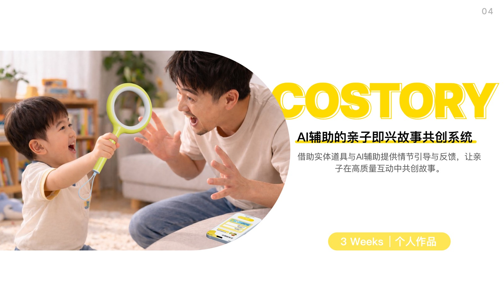

<section class="case-dark-intro" markdown="1">

Core Question

## How can we reduce the risk of storytelling breakdown without interrupting parent-child co-creation?

COSTORY does not use AI to tell stories for children. Instead, when parent-child interaction weakens, the story gets stuck, or the next direction becomes unclear, it provides lightweight prompts, scene feedback, and story organization. The system aims to shift the screen from a controller into an assistant, bringing physical participation, language expression, and emotional response back to the center of parent-child interaction.

</section>

<section class="case-stat" markdown="1">
<strong>78.6%</strong>
Young children spend more than 1 hour on screens each day
</section>
<section class="case-stat" markdown="1">
<strong>53.0%</strong>
Young children spend more than 2 hours on screens each day
</section>
<section class="case-stat" markdown="1">
<strong>3 Dimensions</strong>
Language interaction, physical participation, and emotional response form high-quality parent-child interaction
</section>

<section class="case-section" markdown="1">

01 / Problem Finding

## The screen is not the only problem. Interaction quality matters more.

Young children's screen exposure is commonly high, but the design opportunity is not simply to tell them to use screens less. The more meaningful question is how to bring attention back to shared parent-child activity. After research, I focused on improvisational storytelling games because they naturally combine language expression, physical participation, and emotional response.

<figure class="case-figure" markdown="1">
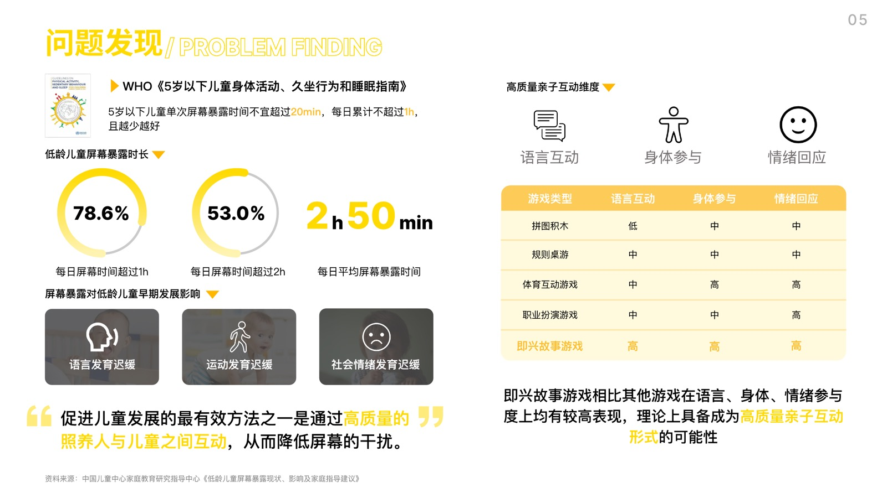
<figcaption>Improvisational storytelling games show strong interaction potential across language, body, and emotion.</figcaption>
</figure>
</section>

<section class="case-section case-section-flip" markdown="1">

02 / User Insight

## The moment of getting stuck is where co-creation breaks most easily.

Parents are willing to participate, but they often lack a stable way to guide the story. Children are used to screen content pushing the experience forward, and once free expression meets a blank moment, they can easily lose interest. The design goal therefore shifted from providing more content to providing the right direction at the point of stagnation.

<figure class="case-figure" markdown="1">
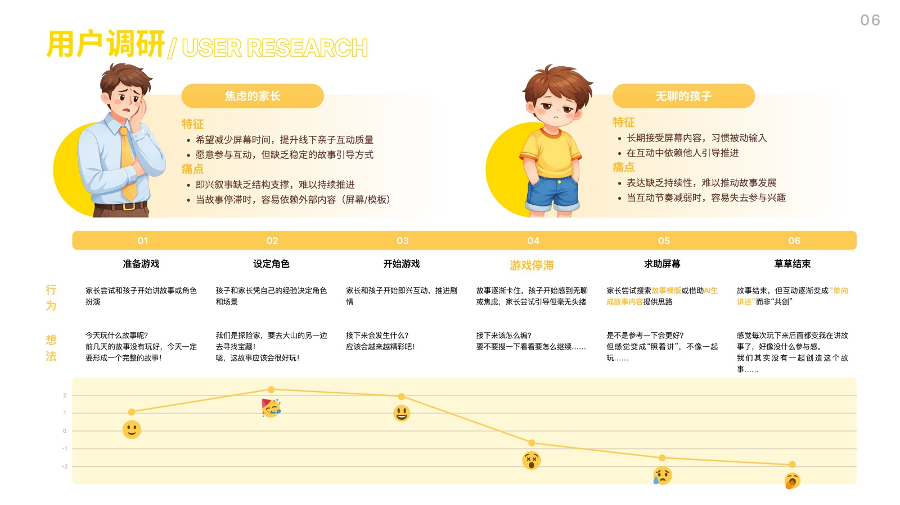
<figcaption>In the user journey, the emotional curve drops clearly during the storytelling stagnation stage, making it the key moment for system support.</figcaption>
</figure>
</section>

<section class="case-opportunity" markdown="1">

03 / Design Opportunities

## Three design opportunities: scene, guidance, and direction.

<article markdown="1">
### Immersive Scene
Turn abstract text into observable and imaginable visuals so children can quickly enter the story.
</article>
<article markdown="1">
### AI-assisted Guidance
When the story gets stuck, provide fuzzy directions and inspiring prompts without making decisions for the users.
</article>
<article markdown="1">
### Narrative Direction
Break the story into characters, context, and events so parents and children can continue around clearer clues.
</article>

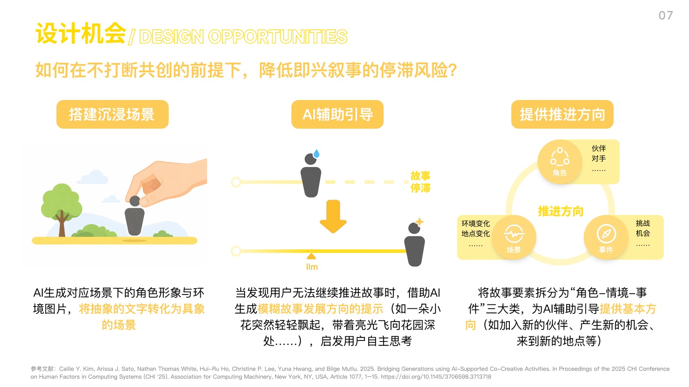
</section>

<section class="case-dark-intro case-flow" markdown="1">

04 / System Plan

## From free co-creation to light AI intervention.

<section markdown="1">
01
### Context Introduction
Users choose the narrative scene and characters, while the system provides an initial story framework.
</section>
<section markdown="1">
02
### Free Progression
Children and parents perform, narrate, and use the prop while the system records without interrupting.
</section>
<section markdown="1">
03
### Stagnation Detection
The system judges whether intervention is needed based on speech pauses, repeated actions, or active help requests.
</section>
<section markdown="1">
04
### Structure Organization
Fragmented expression is organized into story blocks: beginning, conflict, climax, and ending.
</section>
<section markdown="1">
05
### Story Generation
The system generates a complete story while preserving room for users to adjust structure and style.
</section>

</section>

<figure class="case-full-figure" markdown="1">
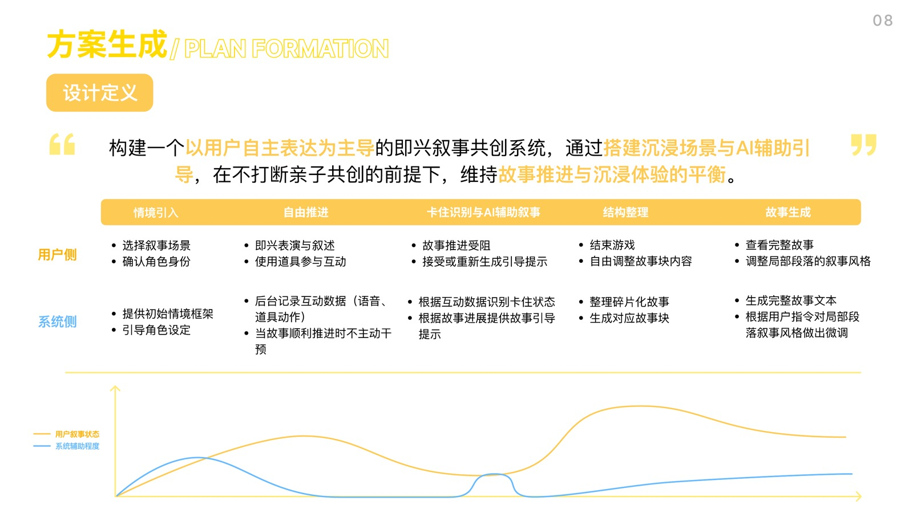
<figcaption>The system assistance level changes with the narrative state: it steps back when the story is smooth, intervenes lightly when the story gets stuck, and helps organize after the session ends.</figcaption>
</figure>

<section class="case-section" markdown="1">

05 / Hardware Design

## The exploration ring brings children back from the screen into physical interaction.

The hardware prototype was developed from children's common play actions: observing, confronting, and exploring. It became a directional exploration ring. The IMU sensor recognizes waving, rotating, and lifting actions, while the vibration motor provides subtle reminders when the story gets stuck. This allows AI assistance to enter the interaction through touch instead of taking over screen attention.

<figure class="case-figure" markdown="1">
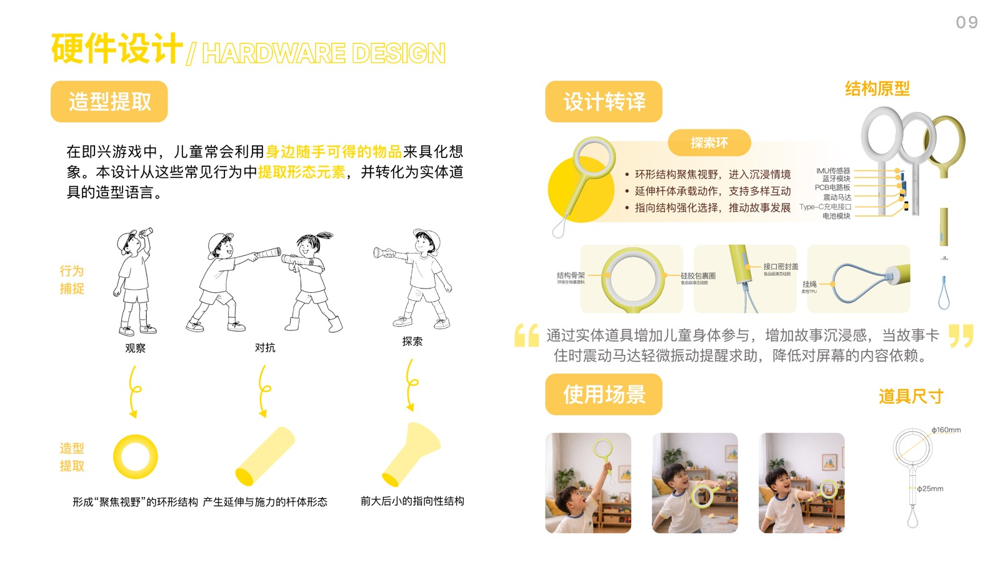
<figcaption>The exploration ring supports observation, action, and help-seeking, connecting story progression with body movement.</figcaption>
</figure>
</section>

<section class="case-section case-section-flip" markdown="1">

06 / Software Design

## The software saves the story instead of replacing the live interaction.

The software includes a welcome page, home page, prop page, story page, story viewer, and personal page. The core idea is not to keep children looking at the screen. Instead, the screen becomes an entry point, recording tool, and review space, while the actual story generation still comes from live language, actions, and shared parent-child imagination.

<figure class="case-figure" markdown="1">
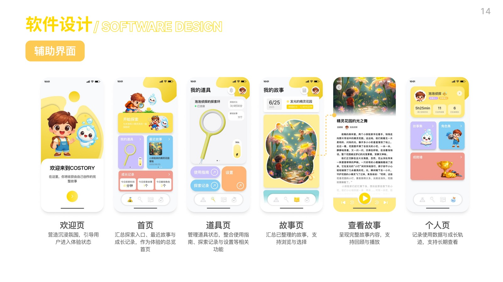
<figcaption>The interface uses a lightweight and child-friendly visual language to organize exploration entry points, prop status, and story outcomes.</figcaption>
</figure>
</section>

<article markdown="1">
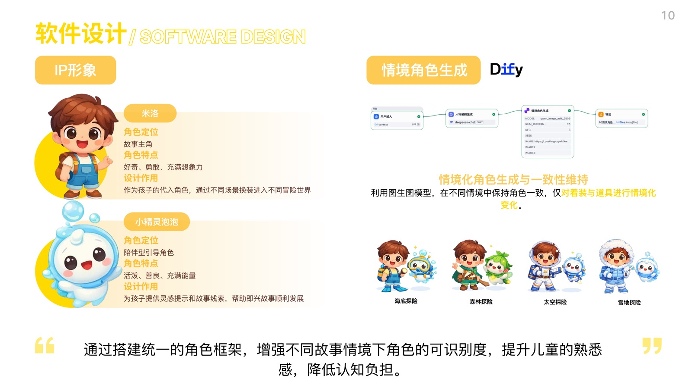
### Character Consistency
Milo and Bubble Detective create stable recognition, making story changes across different scenes easier for children to understand.
</article>
<article markdown="1">
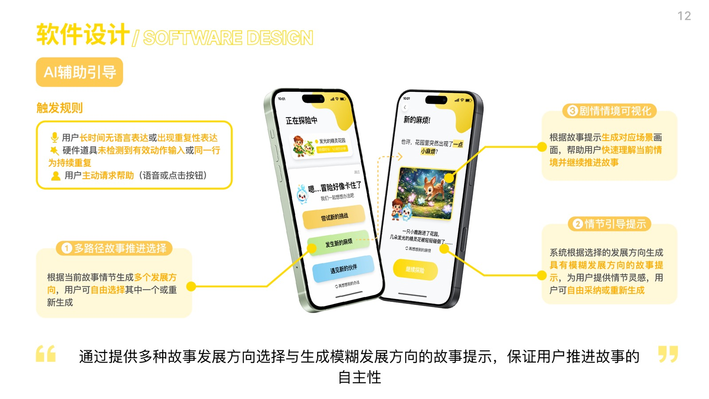
### Context Introduction
Open-ended questions and scene images guide children to express themselves without limiting imagination through fixed choices at the start.
</article>
<article markdown="1">
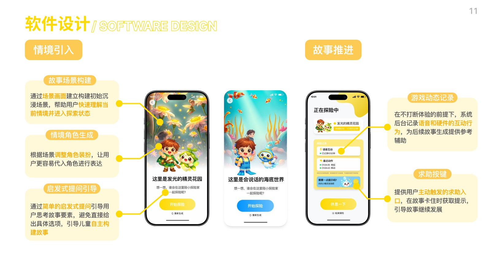
### Light AI Prompts
The system provides multiple development directions and fuzzy plot hints to help the story continue while preserving user choice.
</article>
<article markdown="1">
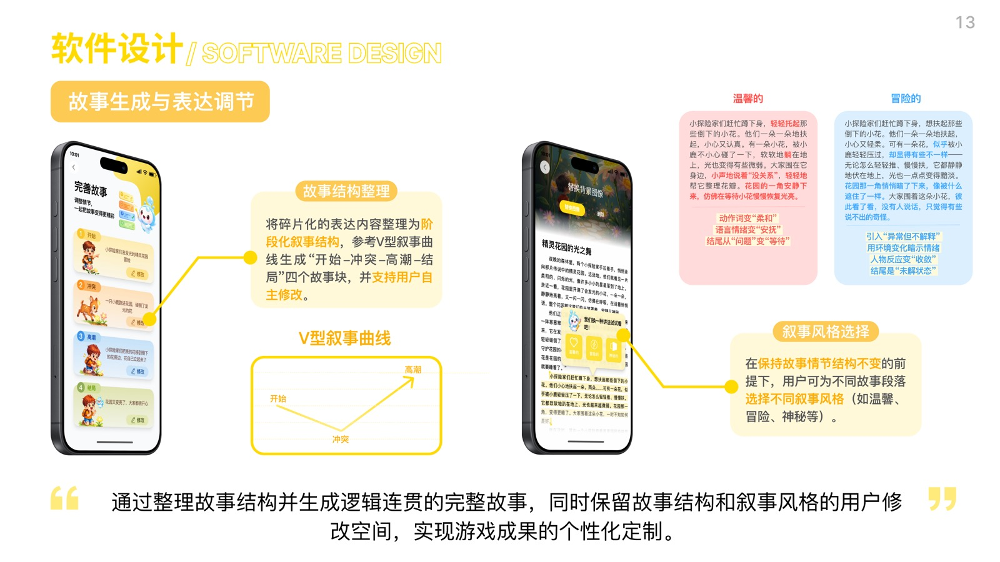
### Story Organization
Fragmented expression is organized into a staged narrative structure, while users can still adjust the narrative style.
</article>

<section class="case-dark-intro" markdown="1">

07 / Prototype Validation

## The key validation is not whether AI can generate, but whether the assistance stays restrained.

Prototype validation focused on three levels: whether the hardware could recognize meaningful actions, whether AI could generate open prompts without replacing the users, and whether the final story could form a clear structure while preserving room for user editing. This direction helped narrow the project from an "AI storytelling tool" into a "parent-child co-creation support system."
</section>

<article markdown="1">
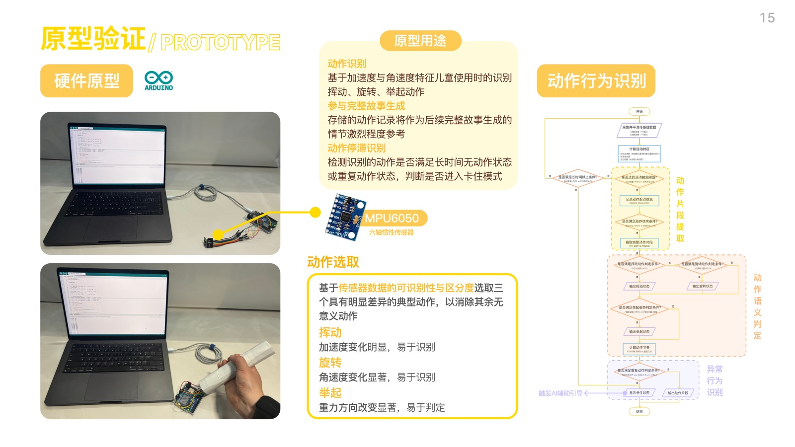
### Action Recognition
Acceleration and angular velocity are used to recognize waving, rotating, and lifting, providing action clues for story progression.
</article>
<article markdown="1">
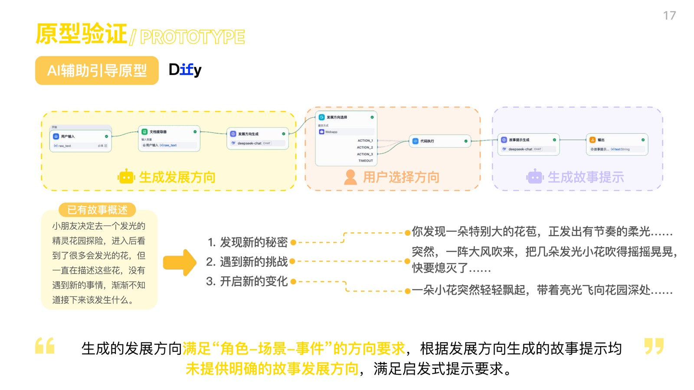
### Scene Generation
Locations and change events are combined to generate scenes so that image and text semantics remain consistent.
</article>
<article markdown="1">
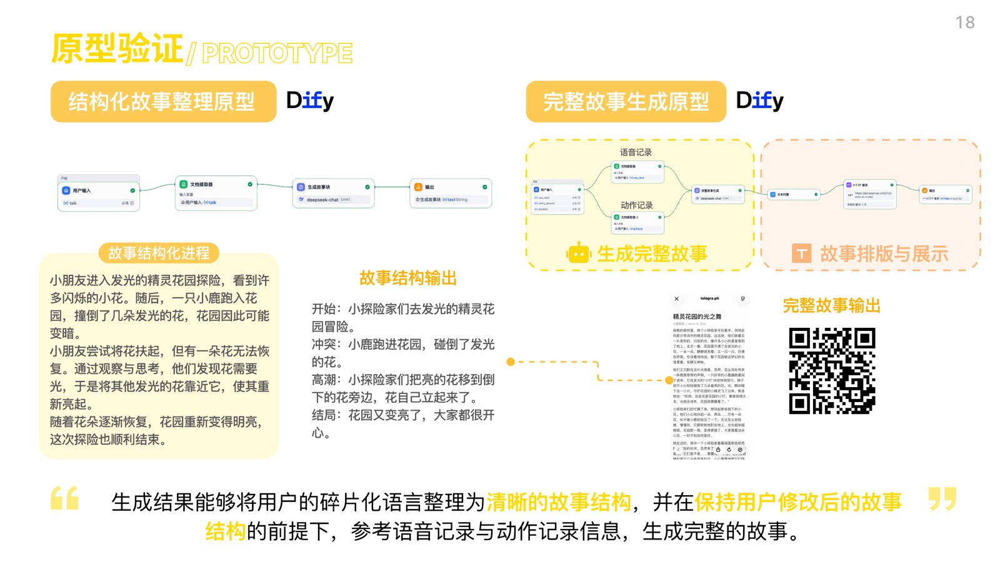
### Development Direction
AI generates directions around character, scene, and event instead of giving a complete answer directly.
</article>
<article markdown="1">
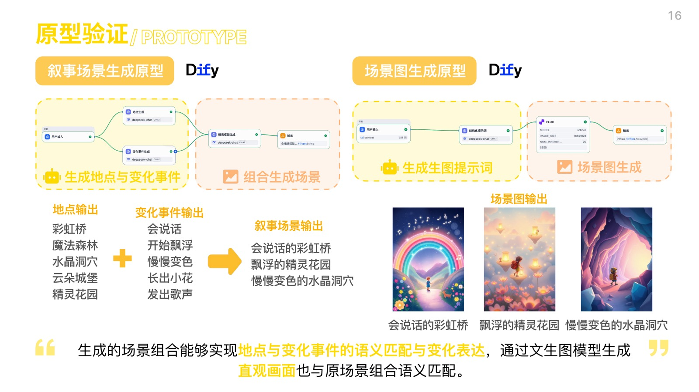
### Complete Story
The final story is generated from speech and action records while preserving structured editing space.
</article>

<section class="case-reflection" markdown="1">

Project Reflection

## The most important judgments I made in this project

<article markdown="1">
### Not adding more screen time, but changing the role of the screen
The screen only supports entry, prompts, and review instead of becoming the center of parent-child interaction.
</article>
<article markdown="1">
### AI should not complete imagination for the users
Good AI intervention should feel like a gentle push, not a takeover of the story.
</article>
<article markdown="1">
### Physical props make interaction more suitable for children
The exploration ring connects seeing and moving, so story progression does not depend only on language and tapping.
</article>

</section>

<a href="../">Back to Projects</a>

</section>

