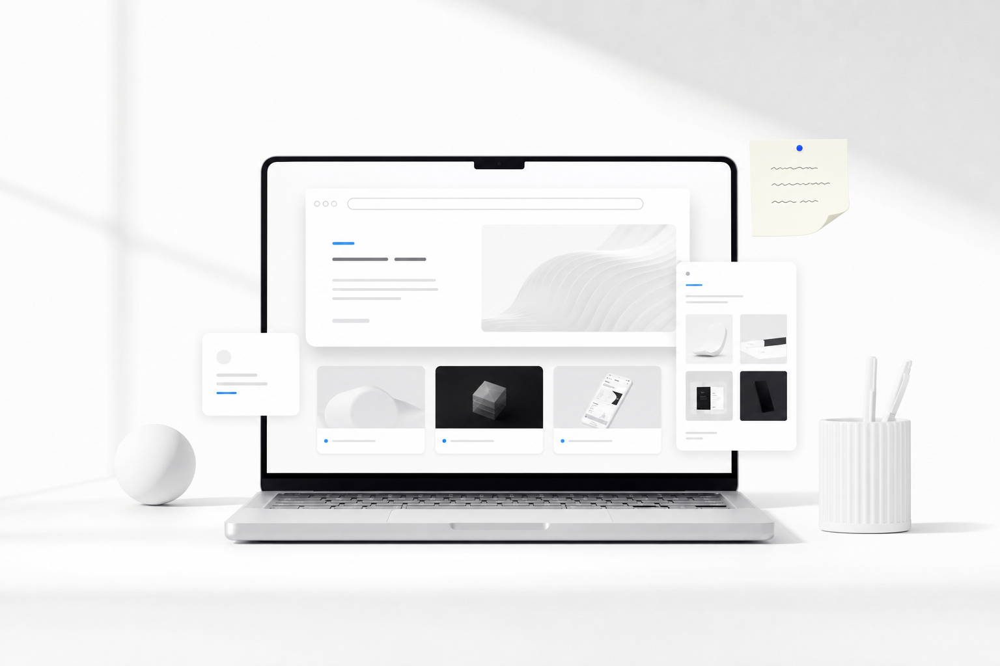

<section class="page-hero page-hero--plain course-hero course-hero--no-watermark">

<h1>旅行博客</h1>

<!-- TRAVEL -->

记录去过的城市、路线印象和旅途中的小笔记。

</section>

<aside class="sidebar">

类型

  <a href="../" class="cat">所有31</a>
  <a href="../../course/technology-site/" class="cat">技术类</a>
  <a href="../../course/design-research/" class="cat">设计类3</a>
  <a href="../2024D20/" class="cat">活动</a>
  <a href="../Japan-travel/" class="cat">实验室生活3</a>
  <a href="./" class="cat cat--active">旅行3</a>

</aside>

去过的城市

<h2>我的旅行地图</h2>

点击城市标记，切换对应的旅行记录。

<button class="travel-pin travel-pin--active" type="button" data-travel-city="shanghai" style="--pin-x: 79%; --pin-y: 48.5%;" aria-label="上海" aria-pressed="true">上海</button>
<button class="travel-pin" type="button" data-travel-city="singapore" style="--pin-x: 75%; --pin-y: 64%;" aria-label="新加坡" aria-pressed="false">新加坡</button>
<button class="travel-pin" type="button" data-travel-city="hong-kong" style="--pin-x: 76.5%; --pin-y: 53.2%;" aria-label="中国香港" aria-pressed="false">中国香港</button>

旅行笔记

学习、设计实践和日常观察的起点。

中国

<h3>上海</h3>
一座把日常生活、学习和设计实践紧密连接在一起的城市。

旅行笔记

在高密度热带城市里观察基础设施、公共空间和设计如何相遇。

新加坡

<h3>新加坡</h3>
紧凑、温暖且高度有序，公共系统的细节随处可见。

旅行笔记

一座由海港、交通和紧凑城市生活共同塑造的立体城市。

中国

<h3>中国香港</h3>
街道、招牌、交通和海港视野叠在一起，形成很强的城市节奏。

